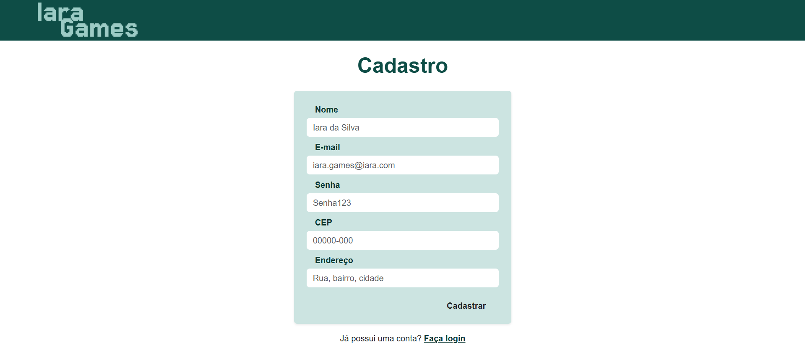

# Iara Games — Login (React)

**Página de Login / Cadastro** da plataforma Iara Games — projeto desenvolvido com Vite + React.  
Esta aplicação demonstra integração com duas APIs externas:

- **MockAPI** (API de usuários) — autenticação e cadastro (mockado).  
- **ViaCEP** — preenchimento automático de endereço via CEP.

---

## Demo (deploy)
A aplicação está publicada em:  
➡️ **https://login-iara-games.vercel.app/**

---

## Screenshot

---

## Funcionalidades principais

- Login com validação contra uma API mock (MockAPI).  
- Cadastro de usuário que salva os dados na MockAPI.  
- Preenchimento automático do endereço via API **ViaCEP** ao informar o CEP.  
- Mensagens de sucesso/erro no login e cadastro.  
- Projeto pronto para deploy (Vercel recomendado).

---

## Tecnologias usadas

- React (Vite)  
- JavaScript (ESModules)  
- Fetch / Axios (consumo de APIs)  
- MockAPI (https://mockapi.io) — para dados de usuário  
- ViaCEP (https://viacep.com.br) — para lookup de CEP  
- Vercel — para deployment
